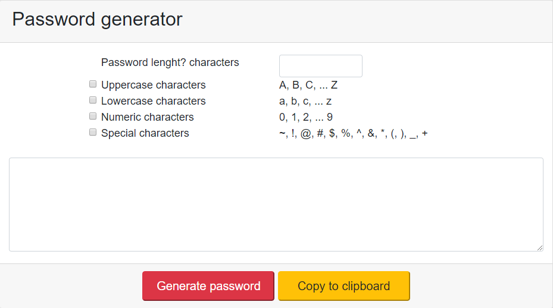

# Password Generator

This application generates a random password based on user-selected criteria. It will run in the browser and feature dynamically updated HTML and CSS powered by your JavaScript code.

## Getting Started

1. Open web browser
2. Navigate to https://ffortizn.github.io/password-generator/

### Prerequisites

Web browser: we recommend google chrome

### Installing

N/A

## Running

The user will be prompted to choose from the following password criteria:
Length (must be between 8 and 128 characters)

Character type:
* Special characters (see examples)
* Numeric characters
* Lowercase characters
* Uppercase characters

Once all prompts are answered, the user will be presented with a password matching the answered prompts

## Built With

* HTML
* CSS
* javascript

## Author

* **Francisco Ortiz** - *Initial work*

